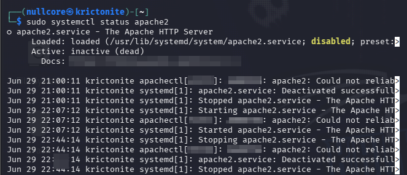
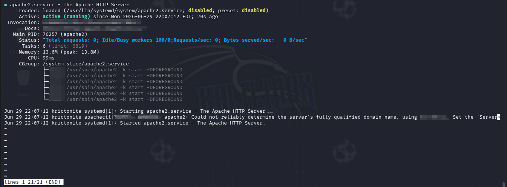
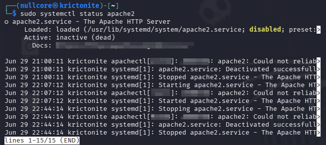
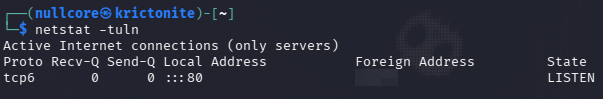
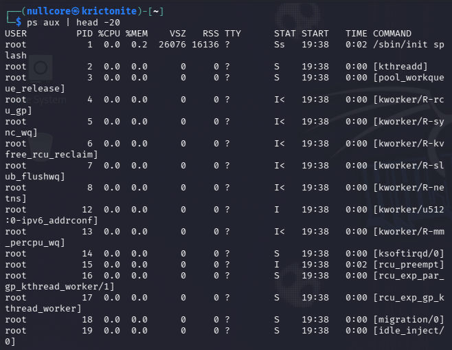
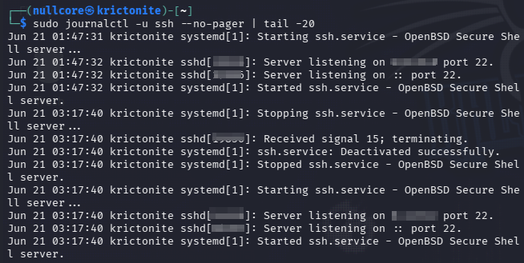

# Linux SOC Fundamentals

Personal documentation of linux commands and concepts applied to Security Operations Center (SOC) environments.

Built while studying Linux Foundation - Introduction to Linux (LFS101) and practicing in a home lab with Kali Linux on VMware.

---

## About This Repository

This repository documents my hands-on learning journey with a focus on SOC analyst skills.
Each command includes a practical explanation of its relevance in security monitoring and incident response.

**Note on evidence images:** All screenshots have sensitive information (IP addresses, MAC addresses, PIDs, port numbers) redacted before publishing, following basic operational security practices.  

---

## 1. Service Management (systemctl)

Managing services is critical in SOC environments to detect unauthorized service changes.

```bash
# Start a service
sudo systemctl start apache2

# Stop a service
sudo systemctl stop apache2

# Restart a service
sudo systemctl restart apache2

# Check service status
sudo systemctl status apache2

# Enable service at boot
sudo systemctl enable apache2

# Disable service at boot
sudo systemctl disable apache2
```

**Evidence:**

Initial state - service inactive:
 

Service running after start:
  

Service stopped again - showing full lifecycle:


**SOC Relevance:**
- Detect if a service was started or stopped without authorization
- Verify if suspicious services are running after an incident
- Part of incident triage: which services are active on a compromised host

---

## 2. Network Connectivity and Diagnostics

Essential commands for verifying connectivity and tracing network paths during incident analysis.

```bash
# Test connectivity and measure latency
ping -c 4 google.com

# Trace route hop by hop
traceroute google.com

# Show open TCP/UDP ports
netstat -tuln

# Show IP and MAC addresses of interfaces
ip a

# Show active network connections
ss -tuln
```

**Evidence:**



**SOC Relevance:**
- Identify unexpected open ports that could indicate backdoors
- Verify suspicious outbound connections during incident response
- Validate network reachability during infrastructure outages

---

## 3. Process Monitoring

Monitoring running processes helps detect malicious or unauthorized activity on a system.

```bash
# Real-time CPU and memory monitoring
top

# List all running processes
ps aux

# Search for a specific process
ps aux | grep ssh

# Kill a process by PID
kill -9 <PID>
```

**Evidence:**


  
**SOC Relevance:**
- Identify suspicious or unknown processes running on a system
- Detect malware or unauthorized scripts executing in background
- Part of live forensics during active incident response

---

## 4. File System Navigation

Basic but essential for navigating systems during investigations.

```bash
# List files and permissions
ls -la

# Show current directory
pwd

# Change directory
cd /var/log

# Show file content
cat file.txt

# Search for text inside files
grep "error" /var/log/syslog

# Find files by name
find / -name "suspicious.sh" 2>/dev/null
```

**SOC Relevance:**
- Navigate to log directories during incident analysis
- Search for indicators of compromise (IOCs) inside log files
- Locate suspicious files dropped by attackers

---

## 5. Log Analysis

Logs are the primary data source for SOC analysts. Modern Linux system (systemd-based, like Kali/Debian) use journalctl instead of relying only on flat log files.

```bash
# View SSH service logs (start/stop events, connections)
sudo journalctl -u ssh --no-pager | tail -20  

# View logs for a specific command execution (e.g. sudo usage)
sudo journalctl _COMM=sudo --no-pager | tail -20

# View system log in real time
journalctl -f

# Search logs for a keyword
journalctl | grep "Failed"

# View last logins
last

# View last failed login attempts
lastb
```

**Evidence:**



This capture shows the SSH service lifecycle (start, stop, restart) with timestamps. Sensitive details like PIDs and ports were redacted before publishing.

**SOC Relevance:**
- Detect brute force attacks via failed login attempts
- Identify unauthorized access or privilege escalation
- Correlate service start/stop events with potential unauthorized changes
- Core skill for SIEM log ingestion and alert triage

---

## 6. User and Permission Management

Understanding users and permissions is key for detecting privilege escalation.

```bash
# Show current user
whoami
  
# Show all users
cat /etc/passwd

# Show groups of a user
groups username
  
# Switch to root
sudo su

# Show sudo privileges
sudo -l
```

**SOC Relevance:**
- Detect unauthorized user creation (common persistence technique)
- Identify privilege escalation attempts
- Verify if attackers added users to sudoers group

---

## Home Lab Setup

| Tool | Purpose |
|------|---------|
| VMware Workstation | Virtualization platform |
| Kali Linux | Security-focused Linux distribution |
| Splunk Free | Log ingestion and SIEM practice |

---

## Certifications

**In progress:** 
- Linux Foundation - Introduction to Linux (LFS101)
- Cisco Network Basics - NetAcad
- AWS Cloud Practitioner Essentials

**Completed:**
- AWS Security - Encryption Fundamentals
- Splunk Intro to Splunk
- Fortinet NSE1
- Cisco Cybersecurity Essentials
- C1b3rwall - OSINT & OT

---

## Related Projects

- [Network-reconnaissance](https://github.com/JonathanInfinity01/network-reconnaissance) - Automated Nmap scanning
- [Wireshark Analysis Project](https://github.com/JonathanInfinity01) - Network traffic analysis
- [Shodan OSINT Project](https://github.com/JonathanInfinity01) - CVE identification on exposed devices

---

## Author

**Jonatan Alexander Guerrero Gomez**

Network Operations Specialist transitioning into Cybersecurity/SOC

Github: [@JonathanInfinity01](https://github.com/JonathanInfinity01)                        

*Continuously updated as I progress through Linux Foundation (LFS101) and SOC studies.*                      


  
  
  
  
